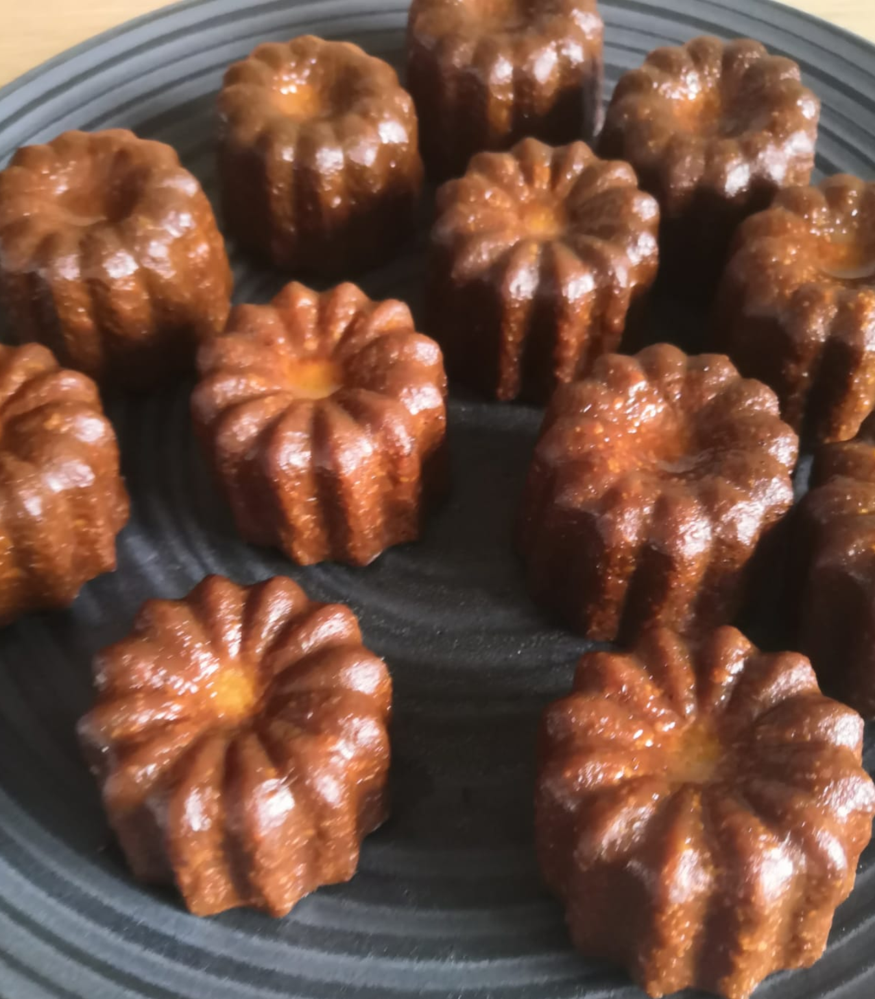

# Cannelés

Super recette et plutôt rapide à faire. j'ai juste modifié la quantité de rhum car c'était un peu trop legé à mon goût. 
Le secret c'est d'avoir des moules en cuivre !

## Ingrédients : 
- 50 cl de lait entier
- 50g de beurre 
- 1 gousse de vanille (ou bien de la poudre de vanille)
- 2 oeufs entiers
- 2 jaunes d'oeufs 
- 100g de farine 
- 4cs de Rhum (je l'ai fait au jugé)

## Etapes de préparation : 
### Etape 1 :
La veille, faire chauffer le lait avec le beurre en morceaux et la gousse de vanille fendue et grattée. Bien mélanger.

### Etape 2 :
Dans un saladier, fouetter les œufs (entiers et les jaunes) avec le sucre en poudre et ajouter la farine.

### Etape 3 : 
Y verser le lait en le filtrant et bien mélanger. Filmer la pâte et placer au réfrigérateur durant 24 h.

### Etape 4 : 
Le lendemain, préchauffer le four th. 250 °c. Ajouter le rhum dans la pâte puis verser dans les moules à cannelé.

### Etape 5 : 
Enfourner 5 min puis baisser le four à 200 °c et laisser cuire durant 50 min à 1 h.

