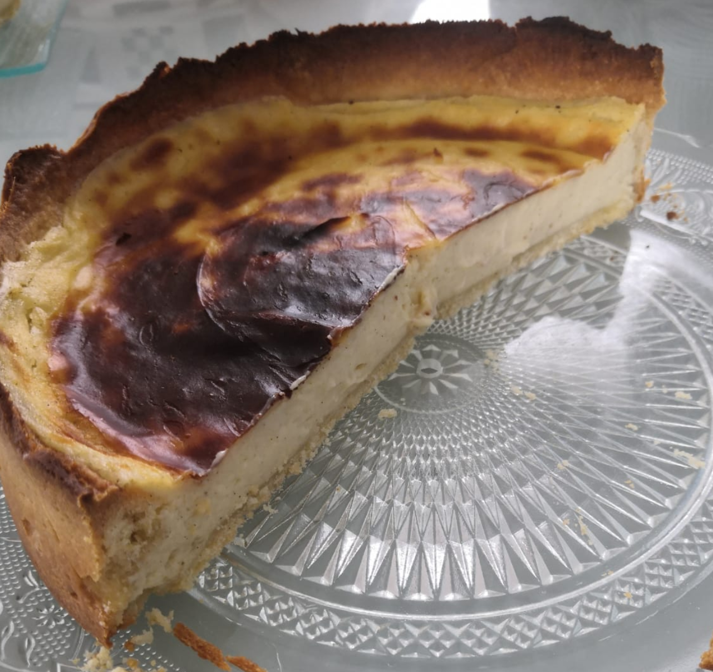

# Flan

Très bonne recette de flan super crémeux. 
Il est tout à fait possible de découper la recette. Par exemple, je prépare souvent la pate sucrée la veille ainsi que l'appreil. Puis je fais le montage et la cuisson le lendemain.
Recette de Norbet Tarayre : [Vidéo](https://www.youtube.com/watch?v=4qof41d2qxE) 
## Ingrédients : 
Pâte sucrée : 
- 110g beurre
- 90g Sucre Glace
- 2g Sel
- 280g Farine
- 2 oeufs
Appareil à flan : 
- 590g lait
- 2 gousse vanille ou bien de la poudre de vanille à mettre au jugé :)
- 90g sucre
- Maizena 66g
- Creme Epaisse 110g (ou crème liquide 110gr)
- Beurre Doux 36g
- 4 oeufs
## Etapes de préparation : 
### Pâte sucrée 
#### Etape 1 :
Dans un robot mélanger le sucre et la beurre et le rendre cremeux. à la fin ajouter le sel.  
#### Etape 2 :
ajouter la farine. 
#### Etape 3 : 
ajouter les oeufs + la vanille(optionnel)
#### Etape 4 : 
Faire une boule puis l'abaisser la pate en lui donnant un début de forme. La filmer et la mettre au frigo au moins une bonne heure ou bien jusqu'à utilisation.  
### Appareil à flan 
#### Etape 1 : 
Mettre une pélicule d'eau dans la casserole puis mettre le lait à chauffer avec la vanille jusqu'à ébulition. 
#### Etape 2 :
Pendant que le lait chauffe, mélanger les oeufs (entiers), le sucre et la maizena pour que ça blanchisse. 
#### Etape 3 : 
Une fois le lait à temprérature, l'ajouter en deux fois au mélange sucre/oeuf afin d'éviter un choc thermique et que les oeufs ne cuissent. une fois le mélange homogène, remettre sur le feux et laisser cuire. 
#### Etape 4 :
Une fois que le mélange a épaissi, laisser cuire une ou deux minutes pour cuire d'amidon. 
#### Etape 5 :
Lorsque l'appreil est prêt, ajouter la crème fraiche et le beurre et mélanger énergiquement.
#### Etape 6 :
filmer au contacte et mettre au frigo au moins 2h ou jusqu'à utilisation.  
### montage et cuisson 
#### Etape 1 :
Sortir l'appreil du frigo et le détentre (rebattre un peu au fouet) pour améliorer la cuisson.
#### Etape 2 :
Sortir la pâte sucrée du frigo et l'abaisser (plus c'st fin meilleur c'est mais plus c'est risqué à démouler)
#### Etape 3 :
Foncer un moule pour le moment je n'ai fait qu'utiliser des moules dont le cerclage s'enlève mais la prochaine fois j'essayerai avec un cercle à tarte. 
#### Etape 4 :
Mettre l'appreil dans le moule foncer et faire cuire 170°C pendant 40min. Chez moi le flan est resté un peu blanc j'ai donc donné de la couleur en mettant la position grill durant quelques minutes. 