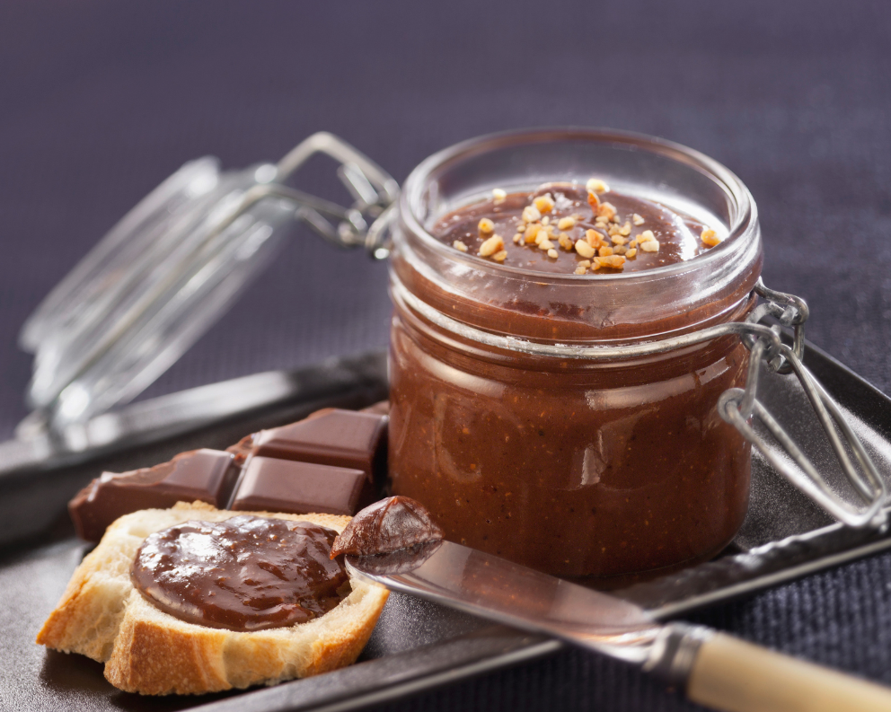

# Pâte à tartiner

Pâte a tartiner très bonne. juste après l'avoir préparer elle est un peu fluide mais après 24h elle se densifie. La recette est normalement réalisée avec des noisettes mais allergie oblige j'ai remplacé par des noix et tout va bien :). 

## Ingrédients : 

- 300 g de noix entières
- 120 g de sucre en poudre
- 150 g de sucre glace
- 170 g de chocolat au noir 70-80%
- 25 g de lait en poudre
- 5 à 10 g d'huile de tournesol

## Etapes de préparation : 

### Etape 1
Préchauffer le four à 180°C (th.6). Disposer les noix sur une plaque allant au four et les laisser torréfier durant 15 minutes environ. C'est une étape que vous pouvez faire en amont. Les rouler sur un torchon, sans vous brûler, afin de retirer la peau. S'il reste un peu de peau ce n'est pas grave en soit mais enlever le maximum pour réduire l'amertume finale.

### Etape 2
Préparer une feuille de papier sulfurisé. Préparer le caramel. Pour cela, mettre dans une casserole à fond épais 1/3 du sucre (soit 40 g) et laisser fondre. Ajouter le 2ème tiers, le laisser fondre puis terminer par les 40 g restants. Laisser fondre complètement, sans remuer. Le caramel doit être blond. Le verser sur votre feuille de papier sulfurisé ou tapis de silicone, laisser durcir puis le casser en petits morceaux. pour cette étape, placer le papier sulfurisé dans un plat en verre et verser le caramele dedans. Une fois qu'il est bien figé, c'est prêt. 

### Etape 3
Mixer 120 g de noix avec les morceaux de caramel. La préparation va se liquéfier. On appelle ça du praliné. Réserver dans un bol. à cette étape il faut être patient, avec mon mixeur (et mon blender), il faut être en vitesse minimale et lorsque ça tourne dans le vide, remettre bien la préparation au centre. au bout de 3 4min le praliné est prêt.  

### Etape 4 
Dans le mixeur, placer à présent les noix restantes et le sucre glace. Mixer jusqu'à obtention d'une pâte assez compacte : on appelle ça de la pâte de noix. Idem il faut être patient et suivre les mêmes conseils que ci-dessus. 

### Etape 5
Faire fondre le chocolat et l'ajouter à la pâte de noix. Ajouter le pralin, le lait en poudre et l'huile. Mixer le tout mais attention : la préparation se liquéfie assez vite. Au départ, la préparation sera assez compact. Plus vous mixerez, plus la préparation va se détendre (ça peut prendre du temps). Je conseil de mixer jusqu'a une texture très nappante. Quand ça refroidira, la pâte se figera (24h environ). 